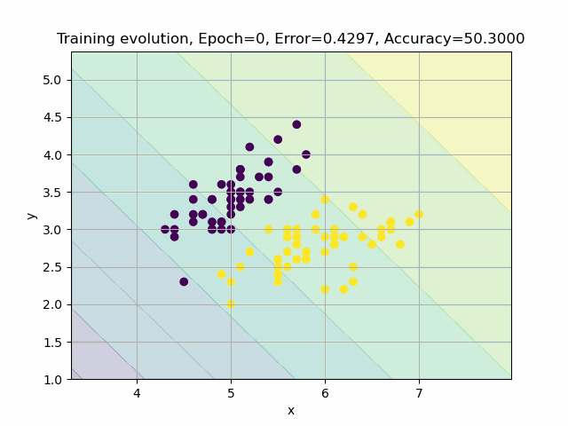
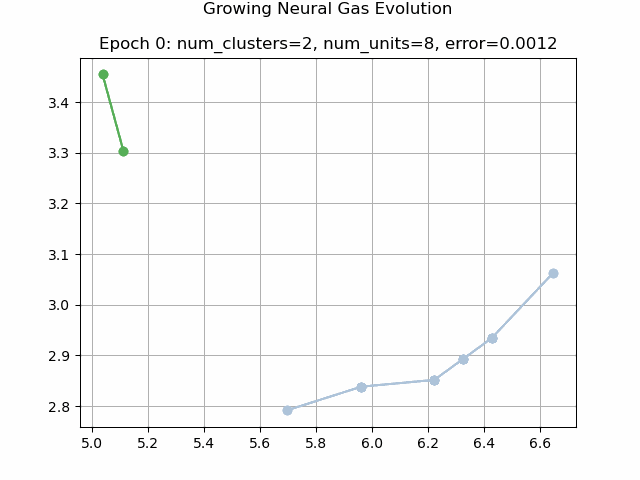

# kata-ialib: Artificial intelligence library

This library contains the implementation of artificial intelligence
modules of different types and classes. Besides, the project includes
visualization, preprocessing utilities, and script examples that tests
the functionality of the artificial intelligence components.

## Examples of Usage

### Perceptron Example

```python
from nnetwork.neurons.perceptron import PerceptronGD
from visualizer import ErrorPlotter, NeuronPlotter, NeuronAnimation
from sklearn import datasets

iris = datasets.load_iris()
x = iris.data[:, :2]
y = iris.target
x, y = x[y != 2], y[y != 2]
    
model = PerceptronGD(lr=0.01, n_epochs=50)
history = model.fit(x, y)

ErrorPlotter().init(errors=history['errors']).show()
NeuronPlotter().init(x=x, y=y, model=model).show()
NeuronAnimation().init(x=x, y=y, model=model).show()
```



### Adaline Example

```python
from nnetwork.neurons.adaline import AdalineGD
from visualizer import ErrorPlotter, NeuronPlotter, NeuronAnimation
from sklearn import datasets
import preprocessing
import numpy as np

iris = datasets.load_iris()
x, y = iris['data'], iris['target']

x = preprocessing.normalize_data(x[50:150, :2])
y = np.where(y[50:150] == 2, -1, y[50:150])
    
model = AdalineGD(lr=0.01, n_epochs=50)
history = model.fit(x, y)

ErrorPlotter().init(errors=history['errors']).show()
NeuronPlotter().init(x=x, y=y, model=model).show()
NeuronAnimation().init(x=x, y=y, model=model).show()
```


### Growing Neural Gas Example

```python
from nnetwork.growing_neural_gas.growing_neural_gas import GrowingNeuralGas
from visualizer import ErrorPlotter, GrowingNeuralGasPlotter, GrowingNeuralGasAnimation
from sklearn import datasets
import tensorflow as tf

iris = datasets.load_iris()
iris = iris.data[:, :]
data = tf.Variable(iris, dtype=tf.float32)

model = GrowingNeuralGas(a_max=4, max_number_units=100, max_clusters=4)
history = model.fit(data)

ErrorPlotter().init(errors=history['errors']).show()
GrowingNeuralGasPlotter().init(history=history).show()
GrowingNeuralGasAnimation().init(history=history).show()
```


